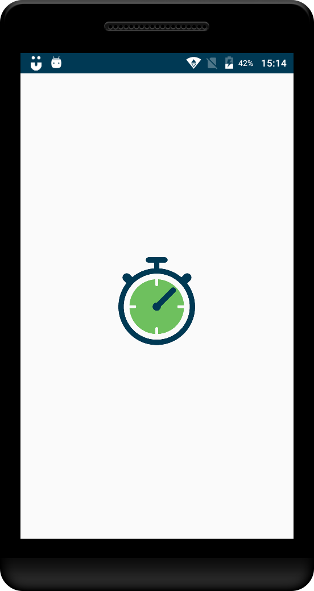
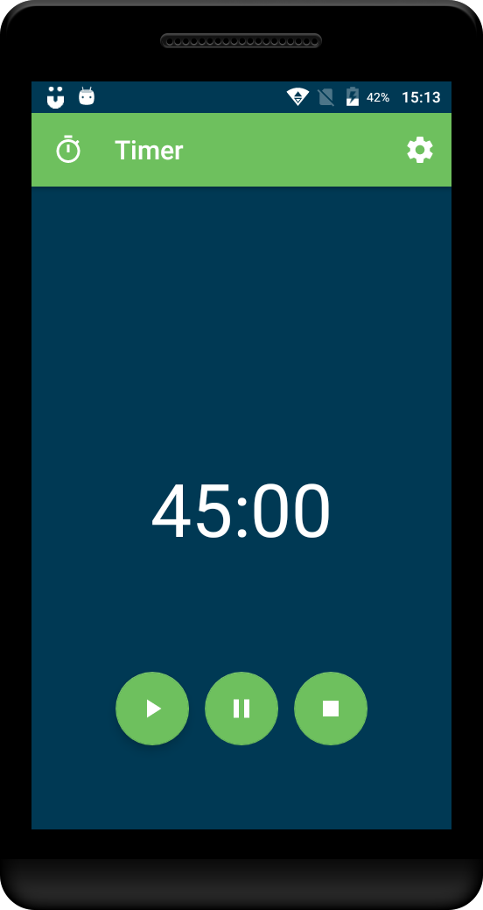
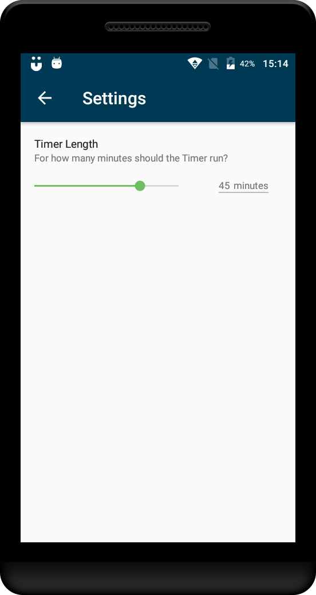

# TimerApp

Timer in Android built in Kotlin

## Google Play Store 
(https://play.google.com/store/apps/details?id=com.anelemhlanga.timerapp)

## Icon

# Screen Shots

## Tools and Technologies
Kotlin
Material Seekbar

